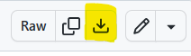

# Data and Analysis Workshop

## About the Workshop

**This course introduces you to "data driven problem solving concepts".**
- Our goal is to provide students an appreciation for data analysis and we assume that students have little to no coding language.
- During the workshop, students are encouraged to focus on the concepts.
- Due to time constraints, we are unable to teach coding.
- There will be a workshop focused on **analysis**:
    - For the analysis workshop, you will need to set up a Colab account. Please see the section below titled **Instructions for students to prepare for the analysis Workshop**.
    - During the class, a Python notebook (code cookbook) will be provided to demonstrate how data can be read, cleaned and processed to answer the problem.
    - If you are interested in additional knowledge on databases, you will need to download data and a set of files. Please see the [instructions](./Data/README.md) by clicking on this link.
- The concepts that you learn can be used in analyzing data using any tool of your choice.

## Instructions for students to prepare for the analysis Workshop
* Download the File [Analysis notebook](./test_notebook.ipynb) to you local machine. This file contains a set of test code that you will upload to Google Colab and test.
    * To download the file, please click on the Download symbol that is seen on the top right corner of the window.
    
    * The Download symbol is highlighted in yellow as shown in this image . If you hover over the Download symbol, you should see the text "Download raw file".
* *Important: Sign in to your GMAIL account and upload the notebook to your Online Drive that is part of your GMAIL account.*
  * If you do not have a GMAIL account, please create one for this course.  
  * Along with the free email account, you also get access to developer tools such as Google Colab and OneDrive to store data. This will make it easier to start running code.
  * Here are the instructions you can use to open a GMAIL account and upload the notebook to Colab [Colab Setup](./gmail_setup.md)
* During the workshop, we will start by setting up the necessary compute, accessing code & data and start working on our problem.
* For those interested in a data analysis career path or want to learn coding, please see [Python resources](./python_introduction.md) for guidance on how to get started.

*THANK YOU*
