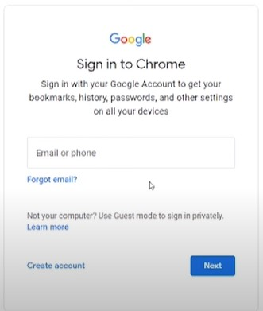

# The method to set up Google Colab is provided here
* Search gmail in your browser and go to the home page for emails. 
* Then you will see this image on the page 
* Sign up for a new email. 
* After signing up, login in to your gmail account.
* In your browser, open a new tab and type the [link](https://colab.research.google.com)
    * You should see a screen that says "Welcome to Colaboratory". 
    * Also, a window called "Open notebook" should appear.
* On the left panel of the "Open notebook" window, select "Upload". 
    * Follow the instructions and upload your Notebook that you downloaded from the classroom.
    * After a few seconds, the notebook will load into the colab.
    * Now, you are almost ready to start running the notebook.
* On the top right corner of the page where your notebook is loaded, click the drop-down button "Connect" and select "Connect to a hosted runtime".
    * Google will provide you free RAM, disk and compute to run your notebook. 
    * Test: 
        * The notebook contains many "cells". Each cell is either used to write documentation or to write code. To test, we will run a cell that contains code. 
        * To do this, Run the cell below the text "import packages". (We can test this in the class)
    * To learn how to run the notebooks, here is a cheat sheet [Notebooks](https://s3.amazonaws.com/assets.datacamp.com/blog_assets/Jupyter_Notebook_Cheat_Sheet.pdf). 
        * Learn the most commonly used commands from this cheat sheet. 
        * Examples are: 
            * Under "Working with Different Programming Languages" see "Restart Kernel" and "Interrupt Kernel"
            * Under "Executing Cells", see "Run selected cell(s)"
        * Ahead of the workshop, please try to run the cells in the notebook to make sure that the set up is successful.
        * If any questions, please reach out to <aifeatures2000@gmail.com>.

